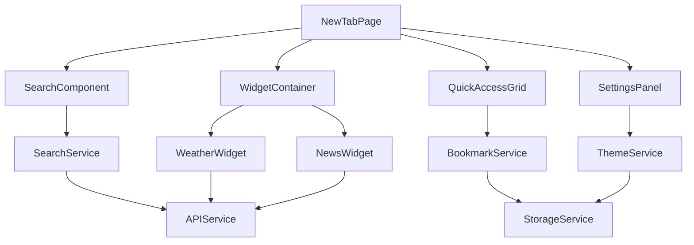

# 设计文档

## 概述

本设计文档详细描述了浏览器新标签页应用的技术架构和实现方案。该应用将作为浏览器扩展开发，采用现代前端技术栈，提供个性化、高效且美观的新标签页体验。应用将整合快速访问、搜索、个性化设置和信息展示等核心功能，通过模块化架构确保代码的可维护性和可扩展性。

## 指导文档对齐

### 技术标准 (tech.md)
由于项目为新项目，将采用以下技术标准：
- 使用现代前端框架（React/Vue.js）确保组件化开发
- 遵循浏览器扩展 Manifest V3 规范
- 采用 TypeScript 提供类型安全
- 使用现代 CSS 框架（Tailwind CSS）确保响应式设计
- 实现 PWA 特性支持离线使用

### 项目结构 (structure.md)
项目将采用以下目录结构：
```
src/
├── components/          # UI 组件
├── services/           # 业务逻辑服务
├── utils/              # 工具函数
├── types/              # TypeScript 类型定义
├── assets/             # 静态资源
├── styles/             # 样式文件
└── manifest.json       # 浏览器扩展清单
```

## 代码重用分析

### 现有组件利用
由于这是新项目，将创建以下可重用组件：
- **BaseComponent**: 提供通用组件基类，包含通用属性和方法
- **ThemeProvider**: 主题管理组件，支持明暗主题切换
- **StorageService**: 本地存储服务，封装浏览器存储 API
- **APIService**: 网络请求服务，处理外部 API 调用

### 集成点
- **浏览器扩展 API**: 通过 chrome.tabs、chrome.bookmarks 等 API 集成浏览器功能
- **本地存储**: 使用 chrome.storage.local 存储用户设置和数据
- **外部 API**: 集成天气、新闻等第三方服务 API

## 架构

### 模块化设计原则
- **单一文件职责**: 每个文件处理一个特定关注点或领域
- **组件隔离**: 创建小型、专注的组件而非大型单体文件
- **服务层分离**: 分离数据访问、业务逻辑和表现层
- **工具模块化**: 将工具分解为专注的、单一用途的模块



## 组件和接口

### NewTabPage 主组件
- **目的**: 新标签页的主容器，协调所有子组件
- **接口**: 
  - `onSearch(query: string)`: 处理搜索请求
  - `onQuickAccessClick(url: string)`: 处理快速访问点击
  - `onSettingsToggle()`: 切换设置面板
- **依赖**: SearchComponent, QuickAccessGrid, WidgetContainer, SettingsPanel
- **重用**: BaseComponent

### SearchComponent 搜索组件
- **目的**: 提供搜索功能和实时建议
- **接口**:
  - `search(query: string)`: 执行搜索
  - `getSuggestions(query: string)`: 获取搜索建议
  - `setSearchEngine(engine: string)`: 设置搜索引擎
- **依赖**: SearchService
- **重用**: BaseComponent

### QuickAccessGrid 快速访问网格
- **目的**: 显示和管理网站快捷方式
- **接口**:
  - `addShortcut(url: string, title: string, icon?: string)`: 添加快捷方式
  - `removeShortcut(id: string)`: 删除快捷方式
  - `reorderShortcuts(order: string[])`: 重新排序
- **依赖**: BookmarkService
- **重用**: BaseComponent

### WidgetContainer 小部件容器
- **目的**: 管理信息小部件的显示和布局
- **接口**:
  - `addWidget(widget: Widget)`: 添加小部件
  - `removeWidget(id: string)`: 移除小部件
  - `updateLayout(layout: Layout)`: 更新布局
- **依赖**: WeatherWidget, NewsWidget, TimeWidget
- **重用**: BaseComponent

### SettingsPanel 设置面板
- **目的**: 提供个性化设置界面
- **接口**:
  - `updateTheme(theme: Theme)`: 更新主题
  - `updateBackground(background: Background)`: 更新背景
  - `saveSettings(settings: Settings)`: 保存设置
- **依赖**: ThemeService, StorageService
- **重用**: BaseComponent

## 数据模型

### Shortcut 快捷方式模型
```
interface Shortcut {
  id: string;           // 唯一标识符
  url: string;          // 网站URL
  title: string;        // 显示标题
  icon?: string;        // 图标URL或base64
  favicon?: string;     // 网站favicon
  createdAt: Date;      // 创建时间
  order: number;        // 排序顺序
}
```

### Widget 小部件模型
```
interface Widget {
  id: string;           // 唯一标识符
  type: WidgetType;     // 小部件类型 (weather, news, time)
  position: Position;    // 位置坐标
  size: Size;           // 尺寸
  config: WidgetConfig; // 配置选项
  enabled: boolean;     // 是否启用
}
```

### Theme 主题模型
```
interface Theme {
  id: string;           // 主题ID
  name: string;         // 主题名称
  colors: ColorScheme;  // 颜色方案
  background: Background; // 背景设置
  fonts: FontSettings;  // 字体设置
}
```

### Settings 设置模型
```
interface Settings {
  theme: Theme;         // 当前主题
  searchEngine: string; // 默认搜索引擎
  widgets: Widget[];    // 小部件配置
  shortcuts: Shortcut[]; // 快捷方式
  layout: Layout;       // 布局设置
}
```

## 错误处理

### 错误场景
1. **网络连接失败**
   - **处理**: 显示离线模式，使用缓存数据
   - **用户影响**: 显示"网络连接失败"提示，提供重试按钮

2. **API 服务不可用**
   - **处理**: 降级到备用服务或显示占位内容
   - **用户影响**: 显示"服务暂时不可用"消息

3. **存储空间不足**
   - **处理**: 清理旧数据，提示用户
   - **用户影响**: 显示存储空间警告，提供清理选项

4. **权限被拒绝**
   - **处理**: 引导用户重新授权
   - **用户影响**: 显示权限请求对话框

## 测试策略

### 单元测试
- 使用 Jest 和 React Testing Library 进行组件测试
- 测试所有服务层的业务逻辑
- 测试工具函数的正确性
- 目标覆盖率：90% 以上

### 集成测试
- 测试组件间的数据流
- 测试服务与 API 的集成
- 测试存储服务的读写操作
- 使用 Cypress 进行端到端测试

### 端到端测试
- 测试完整的用户工作流程
- 测试跨浏览器兼容性
- 测试性能指标（加载时间、内存使用）
- 测试无障碍访问功能